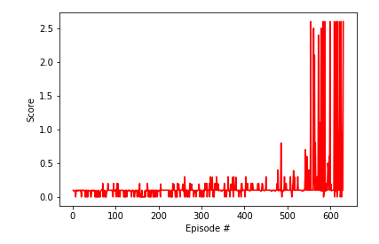

# 
 Competition and Collaboration project Report

> 
 By Soumia Zohra El Mestari

## 1. Introduction : 
This is an Implementation of of a deep reinforcement agent for a Tennis game. The goal of each agent is to keep the ball in the play for as much time steps as possible.

## 2. Environment :

### 2.1 The variables : 

- The observation space consists of 8 variables corresponding to the position and velocity of the ball and racket. Each agent receives its own, local observation. 
- there are two actions possible of a continuous nature : 
    * Toward or away from the net.
    * Jumping .

### 2.2 The rewarding strategy : 
For each agent : 
- An agent receives a reward of **+0.1** if it hits the ball over the net.
- An agent receives a reward of **-0.01** if it hits the ball either on the ground or out of the bounds.

### 2.3 The task's nature :
this task is episodic and the environment is considered to be solved if : we reach an average score (over 100 episodes) of at least +0.5.

## 3. The algorithm :

For this task I used an off-policy method called **Multi Agent Deep Deterministic Policy Gradient (MADDPG)** algorithm that was introduced in the paper  [Continuous control with deep reinforcement learning](https://arxiv.org/abs/1509.02971).

It's a multi-agent version of [DDPG](https://arxiv.org/pdf/1509.02971.pdf) which is an off policy actor critic algorithm with target networks.

The approach addopts the framework of centralized training with decentralized execution. this allows the policies to use extra information to ease training, so long as this information is not used at test time. It is unnatural to do this with Q-learning, as the Q function generally cannot contain different information at training and test time. Thus, we propose a simple extension of actor-critic policy gradient methods where the critic is augmented with extra information about the policies of other agents.
On the other side the actor is exclusive for each agent and it has access to only its agent's observations and actions.

For both the Critic and the Actor neural networks I used 3 layers MLP networks with : 
- A batch normalization layer after the first layer.
- A dropout before the last layer of 0.2.
- A tanh activation faction on the output for the actor network.
- A relu activation function.

And a soft update strategy that consists of mixing 2e-1 of the regular weights with the target network weights.
Regular network is the most up to date network because it's the one used for training.

And the target network is the one used for predicting to stabilise the training process.

This aims to faster the convergence rate.
 
 
 ** The Hyper parameters** : 
 
 
- BUFFER_SIZE = int(1e5)  # replay buffer size
- BATCH_SIZE = 512       # minibatch size
- GAMMA = 0.99            # discount factor
- TAU = 2e-1              # for soft update of target parameters
- LR_ACTOR = 1e-4         # learning rate of the actor 
- LR_CRITIC = 3e-4        #learning rate for the critic 
- WEIGHT_DECAY = 0.0      # L2 weight decay
- ADD_NOISE = True
- UPDATE_EVERY_NB_EPISODE  = 5
- MDPG_UPDATE = 5
- CLIP_CRITIC_GRADIENT = True 

** Some Observations** :

-  A bigger soft update results in a faster training.
- Ornstein-Uhlenbeck noise is used however during one pass I observed that a gaussian noise may result in a faster training as well.

- Having a smaller learning rate for the Actor compared with the critic worked better than having the same learning rate for both.

## 4. Results : 

Environment was solved in 629 episodes with an average reward of 0.51 . The following is a plot showing the evolution of rewards during the tarining .

## 5. Improuvments:
There are several ways to improuve this task among them :
- Do more hyper parameters tunning to improuve the convergence time.
- Try to adapt otehr algorithms like  TRPO or TNPG for a multi agent task .
